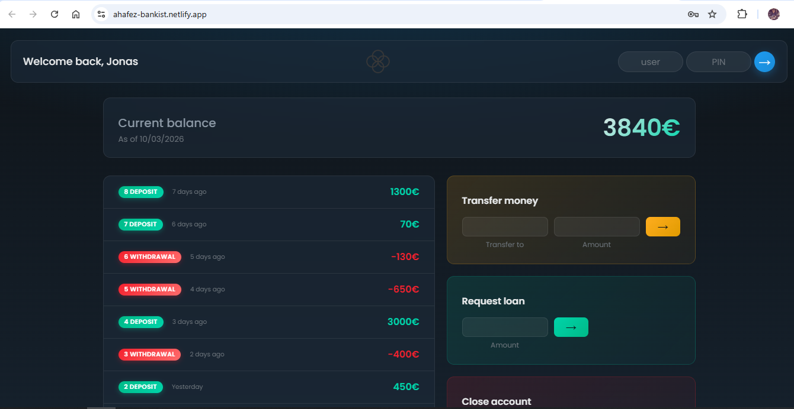

# Bankist – Advanced Fintech Interface

A modern, client-side banking simulation built with **vanilla JavaScript** and a **glassmorphism-inspired UI**. The project focuses on high-performance DOM interactions, clear state management, and a premium user experience—without frameworks—to demonstrate a deep understanding of how the browser works under the hood.

**Live Demo:** (https://ahafez-bankist.netlify.app/)

---

## Overview

**Bankist** is a single-page banking application that lets users log in, view balances and transaction history, transfer money between accounts, request loans, and close an account. The interface is built for smooth transitions, responsive layout, and secure-feel flows (login, auto-logout, validation) while keeping the codebase maintainable and scalable.

Key goals:

- **Performance:** Minimal reflows, batched DOM updates, and CSS-driven animations so the main thread stays responsive.
- **UX:** Clear feedback (loading states, micro-interactions), accessible forms, and mobile-friendly layout.
- **Architecture:** Encapsulated state and behavior in an ES6+ class with private fields, optional chaining, and a single entry point for initialization.

---

## Key Technical Features

### Advanced DOM Manipulation

The app keeps DOM work predictable and efficient:

- **Single-point updates:** The movements list is rebuilt in one pass using `insertAdjacentHTML('afterbegin', ...)` so new rows are inserted without multiple layout recalculations. Content is generated from data (movements array) and written in one batch.
- **Class-based visibility:** The main app panel is shown or hidden by toggling a CSS class (`app--visible`) instead of inline styles. This keeps style logic in the stylesheet and allows transitions (e.g. opacity and staggered fade-in) to run on the compositor where possible.
- **Staggered reveal:** Section visibility uses CSS animations with `animation-delay` so elements fade in sequentially without extra JavaScript, reducing main-thread work and keeping the “premium” feel.

Understanding **layout, paint, and composite** helps here: we avoid forcing synchronous layout (e.g. by reading layout properties after writes) and prefer class toggles and transforms so the browser can optimize rendering.

### Intersection Observer API

The **Intersection Observer API** is the modern, performant way to react when elements enter or leave the viewport. Unlike scroll listeners, it runs asynchronously and doesn’t block the main thread, which is ideal for:

- **Lazy loading images:** Defer loading (or decoding) of images until they are near the viewport, reducing initial load and memory. The observer watches target elements and triggers loading when `isIntersecting` becomes true.
- **Sticky navigation:** Observing a sentinel element above the nav allows toggling a “stuck” state (e.g. adding a class when the nav should be fixed) without scroll handlers that run every frame.

This project’s structure—centralized app controller, clear separation between data and DOM—makes it straightforward to add an observer for a sticky nav or for lazy-loading content (e.g. future image or “load more” sections) without scattering logic. The current UI already avoids heavy initial work and keeps the main thread free for user input.

### Efficient Event Handling

Event handling is designed to be minimal and predictable:

- **Form-level listeners:** Submit and click are both handled. Listeners are attached to **forms** (e.g. `.login`, `.form--transfer`, `.form--loan`, `.form--close`) so both button clicks and Enter key submissions are handled by one handler per form, avoiding duplicate logic and keeping the event model simple.
- **Single controller:** All handlers live inside the `BankistApp` class and use optional chaining when touching the DOM, so missing elements don’t throw and the same code path runs for both click and submit.
- **Delegation-ready structure:** The movements list is rendered into a single container. For future row-level actions (e.g. “Details” on each transaction), **event delegation**—one listener on the container using `event.target` and `closest()`—would avoid attaching a listener per row and would work automatically for dynamically added content. This aligns with how the browser’s event model (capture and bubble) is intended to be used for dynamic UIs.

So the app uses efficient, centralized event binding today and is structured so that delegation can be applied to dynamic lists when needed.

### Security Simulation

The app simulates security-sensitive behavior to reflect real-world concerns:

- **Login:** Credentials are checked (username match and PIN). Failed login does not reveal whether the username or PIN was wrong. Inputs are cleared and focus is managed for accessibility.
- **Auto-logout timer:** A 5-minute countdown starts on login and resets on transfer. When it reaches zero, the session is cleared and the UI returns to the login state. This mimics session expiry and encourages re-authentication after inactivity.
- **Transaction validation:**  
  - **Transfers:** Positive amount, existing recipient, sufficient balance, and no self-transfer. Only after validation are movements pushed and the UI updated.  
  - **Loans:** Amount must be positive and the account must have at least one deposit ≥ 10% of the requested amount.  
  - **Close account:** Username and PIN must match the current account before the account is removed from the in-memory list.

All of this is client-side simulation (no backend), but the patterns—validation before mutation, timer-based logout, and clear state transitions—translate directly to a production design with a real API.

### Modern Enhancements

- **Glassmorphism UI:** Frosted-glass style panels using `backdrop-filter`, semi-transparent backgrounds, and subtle borders. A dark theme with deep navy and electric blue keeps the interface modern and readable.
- **Micro-interactions:** Buttons use `transform: scale()` on `:active` and hover so interactions feel responsive without heavy JS. The sort button label toggles (↓ SORT / ↑ SORT) to reflect state.
- **Loading states:** A full-screen overlay with spinner and message (“Logging in...”, “Transferring...”) and a short simulated delay for login and transfer, improving perceived reliability and giving a clear feedback loop.
- **ES6+ codebase:**  
  - **Private class fields** (`#state`, `#currentAccount`, `#logoutTimerId`, etc.) keep internal state and DOM references encapsulated.  
  - **Optional chaining** (`this.#labelWelcome?.textContent`) and **nullish coalescing** (`message ?? 'Processing...'`) make the code defensive and readable.  
  - **JSDoc** on the module and main methods documents the public contract and parameters.

---

## Tech Stack

| Layer      | Technology                          |
|-----------|--------------------------------------|
| Markup    | **HTML5** (semantic structure, forms, ARIA where needed) |
| Styling   | **CSS3** (custom properties, Grid, Flexbox, transitions, animations, `backdrop-filter`) |
| Script    | **Vanilla JavaScript (ES6+)** (classes, private fields, async/await, modules-style organization) |

No build step is required; the app runs from static files. The CSS is written in plain CSS; the same structure can be ported to **SASS/SCSS** for variables, mixins, and nesting if the project grows.

---

## Architecture

The code is organized in a small number of layers:

1. **Data layer**  
   Account objects (owner, movements, interest rate, PIN) live at the top level. A `createUsernames(accounts)` helper derives `username` from `owner` once at startup. No global mutable state beyond the accounts array and the single `BankistApp` instance.

2. **Application controller**  
   The `BankistApp` class owns:
   - All DOM element references (injected via constructor options).
   - Private state: `#currentAccount`, `#sorted`, `#logoutTimerId`, and the injected `#accounts`.
   - Private methods for UI updates: `#displayMovements`, `#calcDisplayBalance`, `#calcDisplaySummary`, `#displayDate`, `#updateUI`.
   - Private helpers for flow: `#showSpinner`, `#hideSpinner`, `#withNetworkDelay`, `#startLogoutTimer`.
   - Event handlers: `#handleLogin`, `#handleTransfer`, `#handleLoan`, `#handleClose`, `#handleSort`.

   Events are bound once in `#bindEvents()`. Handlers validate input, update state (and optionally the in-memory accounts), then call `#updateUI` or targeted DOM updates. The logout timer is (re)started on login and on transfer.

3. **Initialization**  
   After defining accounts and calling `createUsernames(accounts)`, a single `new BankistApp({ ... })` is created with `document.querySelector` / `getElementById` results and the `accounts` array. No further globals are exposed; the rest runs inside the class.

This keeps a clear flow: **data → controller → DOM**, with the browser’s event loop and rendering pipeline doing the rest.

---

## How to Run

1. **Clone or download** the project (ensure `index.html`, `script.js`, and `style.css` are in the same directory; optional: `logo.png`, `icon.png`).
2. **Open in the browser:**  
   - Double-click `index.html`, or  
   - Right-click → “Open with” → your browser.
3. **Or use a local server (recommended for consistency):**  
   - **VS Code:** Install the “Live Server” extension, right-click `index.html` → “Open with Live Server.”  
   - **Node:** e.g. `npx serve .` or `npx live-server` in the project folder.  
   - **Python:** `python -m http.server 8000` then visit `http://localhost:8000`.

**Demo logins (username / PIN):**

- `js` / `1111`
- `jd` / `2222`
- `stw` / `3333`
- `ss` / `4444`

After login, try transfers (e.g. to `jd`), loan requests, sorting movements, and the auto-logout timer to see the full flow.

---

## Summary

Bankist is a focused example of a **vanilla-JS fintech-style UI** with:

- Efficient DOM updates and CSS-driven transitions.
- A structure that supports patterns like **Intersection Observer** (lazy loading, sticky nav) and **event delegation** for dynamic content.
- Simulated security behavior (login, auto-logout, validation) and a modern, glassmorphism-based interface with micro-interactions and loading states.
- An ES6+ architecture with private class fields and clear separation of data, controller, and view.

It is built to show how a solid understanding of the browser’s rendering and event model can yield a fast, maintainable, and user-friendly application without a framework.
